---
# try also 'default' to start simple
theme: default
colorSchema: light
# random image from a curated Unsplash collection by Anthony
# like them? see https://unsplash.com/collections/94734566/slidev
background: https://cover.sli.dev
# some information about your slides (markdown enabled)
title: IDA Driving AI, Model Compression
info: |
  ## Slidev Starter Template
  Presentation slides for developers.

  Learn more at [Sli.dev](https://sli.dev)
# apply UnoCSS classes to the current slide
class: text-center
# https://sli.dev/features/drawing
drawings:
  persist: false
# slide transition: https://sli.dev/guide/animations.html#slide-transitions
transition: slide-left
# enable Comark Syntax: https://comark.dev/syntax/markdown
comark: true
# duration of the presentation
duration: 20min
addons:
  - tikzjax
---

# Smaller and Faster AI

## A Primer in Model Compression


Rasmus Aagaard

*github.com/rasgaard/slides*

---
layout: two-cols
---

# whoami
::left::
- MSc. Human-Centered AI, DTU Compute
  - Graduated 2023
- Research Assistant, DTU Compute
  - 2023 $\rightarrow$ 2024
- Data Scientist, Laerdal Medical
  - 2024 $\rightarrow$ 2025
- Industrial PhD Student, Laerdal Medical & DTU, 
  - 2025 $\rightarrow$ Present 
  - *Edge deployment of Deep Neural Networks via **Model Compression** for Healthcare Applications*
::right::
<div style="display: flex; justify-content: center; align-items: center; gap: 18px; background: rgba(255,255,255,0.8); border-radius: 10px; padding: 50px 14px; max-width: 280px; margin: 0 auto;">
  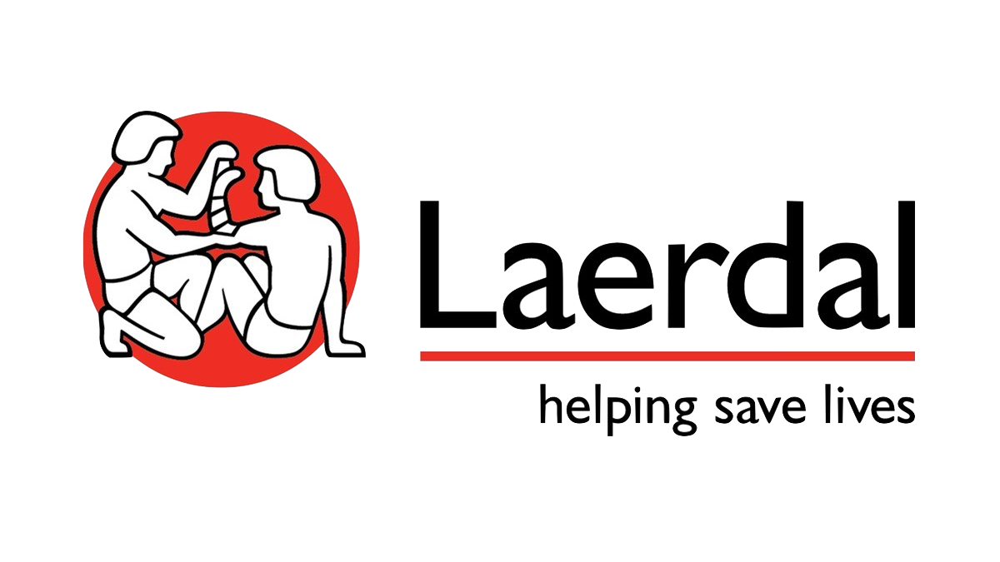
  
</div>

---
layout: image-right
image: ./assets/theoffice.png
---

# ... Laerdal Medical?
- Medical simulators
- Simulation software
- Resuscitation training 

---
layout: quote
---

#### For the **first time** in history, more people die from *poor-quality* care than from *lack of access*^[The Lancet, Mortality due to low-quality health systems in the universal health coverage era: a systematic analysis of amenable deaths in 137 countries] 

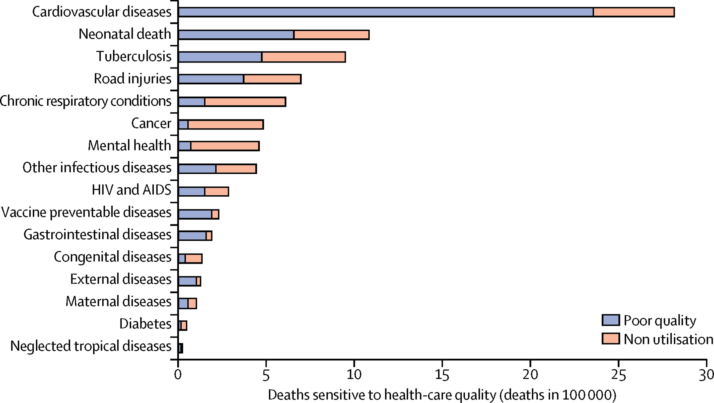


---
layout: image
image: ./assets/product examples/rqi_cpr_training.png
backgroundSize: contain
---

---
layout: image
image: ./assets/product examples/low_income_birthing_simulator.png
backgroundSize: contain
---

---
layout: image
image: ./assets/product examples/vrclinicals.png
backgroundSize: contain
---

---
layout: image
image: ./assets/product examples/bhf_microsoft.png
backgroundSize: contain
---

---
layout: image
image: ./assets/onemillionlives.png
backgroundSize: contain
---

---
layout: image
image: ./assets/technology.png
backgroundSize: contain
---

---
layout: cover
---

## Model Compression

Quantization and <span v-mark.underline>Pruning</span>

---
layout: default
---
# Pruning

<div class="flex flex-col items-center">
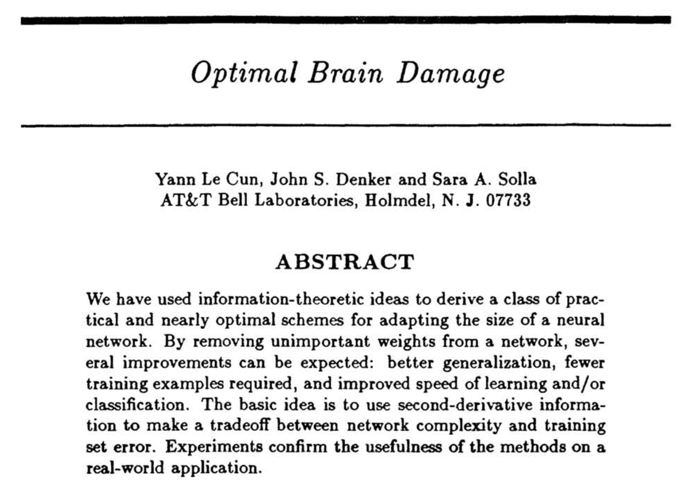
<p class="text-xs text-gray-400 mt-2 text-center"><em>LeCun, Y., Denker, J., & Solla, S. (1989). Optimal brain damage. Advances in neural information processing systems, 2.</em></p>
</div>

---
layout: two-cols-header
---
# Pruning
*What if some neurons aren't all that important?*
::left::

How can we measure neuron importance?

$$
a_j^{(l)}(x) = \sigma\!\left(\sum_i w_{ij}^{(l)}\, a_i^{(l-1)}(x) + b_j^{(l)}\right)
$$

$$
I_j^{(l)} = \frac{1}{|\mathcal{D}|} \sum_{x \in \mathcal{D}} \left| a_j^{(l)}(x) \right|
$$

Prune neuron $j$ if $I_j^{(l)} < \tau$

<div class="text-xs text-gray-400 mt-2">

- $a_j^{(l)}(x)$ — activation of neuron $j$ in layer $l$ for input $x$
- $\mathcal{D}$ — calibration set
- $\tau$ — pruning threshold

</div>

::right::
<div class="flex flex-col items-center">
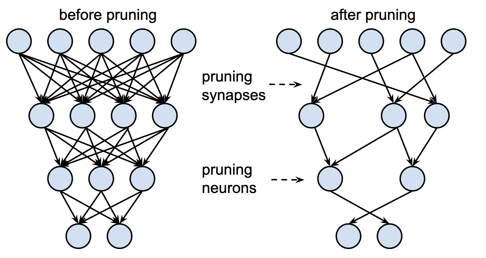
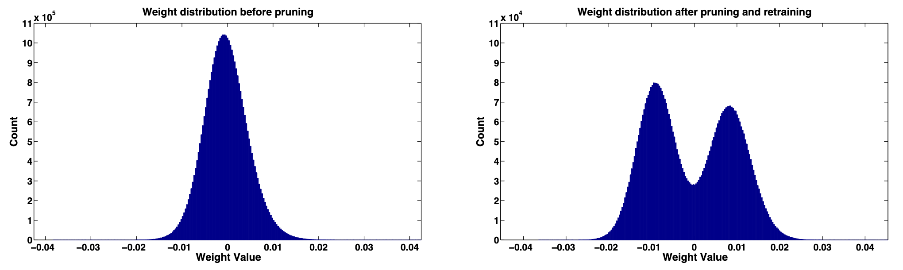
<p class="text-xs text-gray-400 mt-2 text-center"><em>Han, S., Pool, J., Tran, J., & Dally, W. (2015). Learning both weights and connections for efficient neural network. Advances in neural information processing systems, 28.</em></p>
</div>


---

# Pruning

<div class="flex gap-12 justify-center items-center mt-12">

<div class="flex flex-col items-center">
  <p class="text-sm font-semibold text-gray-500 mb-4">Unstructured</p>
  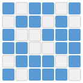
  <p class="text-xs text-gray-400 mt-2">□ zeros still occupy memory and compute time</p>
</div>

<div v-click class="flex flex-col items-center">
  <p class="text-sm font-semibold text-gray-500 mb-4">Structured</p>
  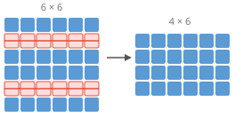
  <p class="text-xs text-gray-400 mt-2">Removing 2 neurons → smaller dense matrix → direct speedup</p>
</div>

<div v-click class="flex flex-col items-center">
  <p class="text-sm font-semibold text-gray-500 mb-4">Semi-Structured (2:4)</p>
  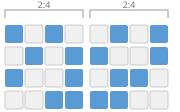
  <p class="text-xs text-gray-400 mt-2">Each group of 4 contains exactly 2 non-zero weights</p>
</div>

</div>

---
layout: two-cols-header
---

# Pruning
::left::

- Can we remove entire layers of the Whisper's encoder transformer stack?
- Yes! Roughly 20% (6 layers) with minor degredation
<div class="text-sm">

| Language | Baseline WER | Zero-shot pruned | After distillation |
|----------|-------------|-----------------|-------------------|
| Danish   | 23.9%       | 38% (+59%)      | 27.8% (+16%)      |
| English  | 15.4%       | 16.8% (+9%)     | 16.3% (+6%)       |
| German   | 17.1%       | 18.6% (+9%)     | 18.3% (+7%)       |
| Swedish  | 17.4%       | 23.9% (+37%)    | 20.1% (+16%)      |
| **Mean** |             | **+20.9%**      | **+7.5%**         |

</div>

*<p class="text-xs text-gray-400 mt-2">WER on FLEURS test splits before pruning (baseline), after zero-shot pruning, and after distillation on pruned encoder.</p>*
::right::

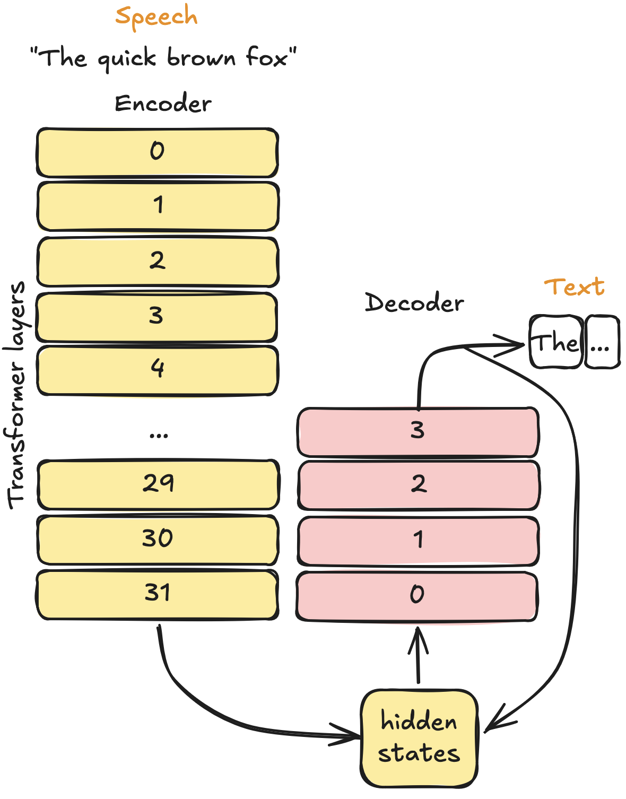

---
layout: cover
---

## Model Compression

<span v-mark.underline>Quantization</span> and Pruning

---
layout: two-cols-header
---
# Quantization

*What if it was fine to have lower precision weights?*

::left::
- What do we mean by *lower precision*?

```python{all|3-5|7-8|10-11}
import torch

a = torch.tensor(15.3231)
a.dtype
>>> torch.float32

a.to(dtype=torch.float16)
>>> tensor(15.3203, dtype=torch.float16)

a.to(dtype=torch.int8)
>>> tensor(15, dtype=torch.int8)
```

::right::

- More bits $\rightarrow$ Higher numerical precision
- Fewer bits $\rightarrow$ Lower memory footprint 
- Balance number of bits and quantization error


$$
  a_j^{(l)}(x) = \sigma\!\left(\sum_i w_{ij}^{(l)}\, a_i^{(l-1)}(x) + b_j^{(l)}\right)
$$ 

---
layout: two-cols-header
---
# Quantization


::left::

$$
\begin{aligned}
s &= \dfrac{\max(|x|)}{127} \\[10pt]
q &= \operatorname{clamp}\!\left(\left\lfloor \dfrac{x}{s} \right\rceil,\ {-128},\ 127\right) \\[10pt]
\hat{x} &= q \cdot s
\end{aligned}
$$

::right::

```python{all|4|7|9-12|14-15}
import torch

torch.finfo(torch.float32)
>>> finfo(min=-3.40282e+38, max=3.40282e+38, dtype=float32)

torch.iinfo(torch.int8)
>>> iinfo(min=-128, max=127, dtype=int8)

def quantize(x):
    scale = x.abs().max() / 127
    q = x.div(scale).round().clamp(-128, 127).to(torch.int8)
    return q, scale

def dequantize(q, scale):
    return q.to(torch.float32) * scale
```

---
layout: two-cols-header
---

# Quantization 

::left::

**Original weights** $W$

$$
W = \begin{bmatrix} 0.23 & -0.41 & 0.87 \\ -0.12 & 0.55 & -0.73 \\ 0.19 & -0.35 & 0.62 \end{bmatrix}
$$

<div v-click="1">

**Quantized** $Q$ (INT8)

$$
Q = \begin{bmatrix} 34 & -60 & 127 \\ -18 & 80 & -107 \\ 28 & -51 & 91 \end{bmatrix}
$$
</div>

<div v-click="3">

**Dequantized** $\hat{W}$

$$
\hat{W} = Q \cdot s \approx \begin{bmatrix} 0.233 & -0.411 & 0.870 \\ -0.123 & 0.548 & -0.733 \\ 0.192 & -0.349 & 0.623 \end{bmatrix}
$$

</div>

::right::

**Scale** $s$
$$
s = \frac{\max(|W|)}{127} = \frac{0.87}{127} \approx 0.0069
$$

<div v-click="2">

**Intuition** Mapping number lines

```tikzjax
\begin{document}
  \begin{tikzpicture}[scale=0.95]
    % FP32 number line (blue, continuous)
    \node[anchor=east, blue, font=\small\bfseries] at (-0.3, 0.8) {FP32};
    \draw[blue!60, line width=1.5pt] (0,0.8) -- (6,0.8);
    \foreach \x/\lbl in {0/{$-$0.87}, 3/{0}, 6/{0.87}} {
      \draw[gray!70] (\x,0.55)--(\x,1.05);
      \node[above, gray!70, font=\tiny] at (\x,1.05) {\lbl};
    }
    \fill[blue!80] (4.9,0.8) circle (3pt);
    \node[above, blue!80, font=\small\bfseries] at (4.9,1.35) {0.55};

    % INT8 number line (teal, discrete ticks)
    \node[anchor=east, teal, font=\small\bfseries] at (-0.3,-0.8) {INT8};
    \draw[teal!60, line width=1.5pt] (0,-0.8) -- (6,-0.8);
    \foreach \i in {0,1,...,63} {
      \draw[teal!40] ({\i*6/63},-0.94)--({\i*6/63},-0.66);
    }
    \foreach \x/\lbl in {0/{$-$128}, 3/{0}, 6/{127}} {
      \draw[gray!70] (\x,-1.1)--(\x,-0.5);
      \node[below, gray!70, font=\tiny] at (\x,-1.1) {\lbl};
    }
    \fill[teal!80!black] (4.9,-0.8) circle (3pt);
    \node[below, teal!80!black, font=\small\bfseries] at (4.9,-1.35) {80};

    % Mapping arrow: 0.55 → 80 (same x position, linear mapping)
    \draw[->, orange, thick, dashed] (4.9,0.5) -- (4.9,-0.5)
      node[midway, right, orange, font=\scriptsize] {};
  \end{tikzpicture}
\end{document}
```

</div>

<div v-click="4">

**Error**, $\Delta W$
$$
\Delta W = W - \hat{W} \approx \begin{bmatrix} -0.003 & 0.001 & 0.000 \\ 0.003 & 0.002 & 0.003 \\ -0.002 & -0.001 & -0.003 \end{bmatrix}
$$
</div>


---
layout: default
---

# Quantization

<div class="flex items-center justify-center gap-12 mt-16">
  
  <div class="text-5xl text-gray-400">→</div>
  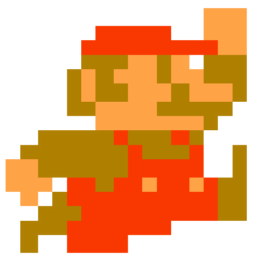
</div>
---
layout: two-cols-header
---

# Quantization
*So can we just INT8 quantize LLMs and make them smaller?*

::left::
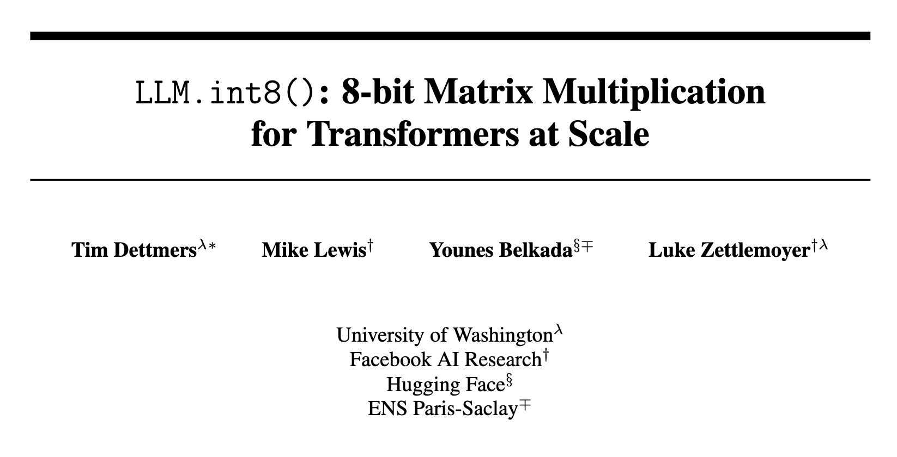
<p class="text-xs text-gray-400 mt-2 text-center"><em>
Dettmers, T., Lewis, M., Belkada, Y., & Zettlemoyer, L. (2022). LLM.int8 (): 8-bit matrix multiplication for transformers at scale. Advances in neural information processing systems, 35, 30318-30332.
</em></p>
::right::
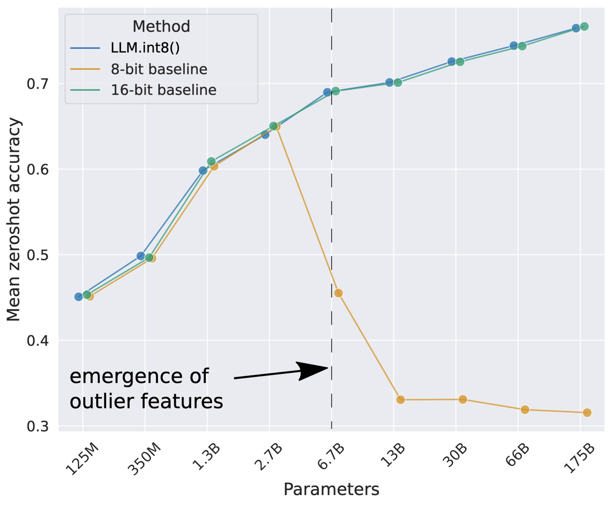

---
layout: two-cols-header
---

# Quantization, *outliers :(*
::left::

**Original weights** $W$

$$
W = \begin{bmatrix} 0.23 & -0.41 & {\color{red}8.72} \\ -0.12 & 0.55 & -0.73 \\ 0.19 & -0.35 & 0.62 \end{bmatrix}
$$

<div v-click="1">

**Quantized** $Q$ (INT8)

$$
Q = \begin{bmatrix} 3 & -6 & {\color{red}127} \\ -2 & 8 & -11 \\ 3 & -5 & 9 \end{bmatrix}
$$
</div>

<div v-click="3">

**Dequantized** $\hat{W}$

$$
\hat{W} = Q \cdot s \approx \begin{bmatrix} 0.206 & -0.412 & 8.725 \\ -0.137 & 0.550 & -0.756 \\ 0.206 & -0.344 & 0.618 \end{bmatrix}
$$

</div>

::right::

**Scale** $s$
$$
s = \frac{\max(|W|)}{127} = \frac{{\color{red}8.72}}{127} \approx 0.0687
$$

<div v-click="2">

**Intuition** Mapping number lines

```tikzjax
\begin{document}
  \begin{tikzpicture}[scale=0.95]
    % FP32 number line (blue, continuous)
    \node[anchor=east, blue, font=\small\bfseries] at (-0.3, 0.8) {FP32};
    \draw[blue!60, line width=1.5pt] (0,0.8) -- (6,0.8);
    \foreach \x/\lbl in {0/{$-$8.72}, 3/{0}, 6/{8.72}} {
      \draw[gray!70] (\x,0.55)--(\x,1.05);
      \node[above, gray!70, font=\tiny] at (\x,1.05) {\lbl};
    }
    % 0.55 at (0.55+8.72)/17.44*6 ≈ 3.19
    \fill[blue!80] (3.19,0.8) circle (3pt);
    \node[above, blue!80, font=\small\bfseries] at (3.19,1.35) {0.55};
    % outlier 8.72 at x=6
    \fill[red!80] (6,0.8) circle (3pt);
    \node[above, red!80, font=\small\bfseries] at (5.7,1.35) {8.72};

    % INT8 number line (teal, discrete ticks)
    \node[anchor=east, teal, font=\small\bfseries] at (-0.3,-0.8) {INT8};
    \draw[teal!60, line width=1.5pt] (0,-0.8) -- (6,-0.8);
    \foreach \i in {0,1,...,63} {
      \draw[teal!40] ({\i*6/63},-0.94)--({\i*6/63},-0.66);
    }
    \foreach \x/\lbl in {0/{$-$128}, 3/{0}, 6/{127}} {
      \draw[gray!70] (\x,-1.1)--(\x,-0.5);
      \node[below, gray!70, font=\tiny] at (\x,-1.1) {\lbl};
    }
    % 8 at (8+128)/256*6 ≈ 3.19
    \fill[teal!80!black] (3.19,-0.8) circle (3pt);
    \node[below, teal!80!black, font=\small\bfseries] at (3.19,-1.35) {8};
    % 127 at x=6
    \fill[red!80] (6,-0.8) circle (3pt);
    \node[below, red!80, font=\small\bfseries] at (6,-1.35) {127};

    % Mapping arrow: 0.55 → 8
    \draw[->, orange, thick, dashed] (3.19,0.5) -- (3.19,-0.5)
      node[midway, right, orange, font=\scriptsize] {};
    % Mapping arrow: 8.72 → 127
    \draw[->, red!60, thick, dashed] (6,0.5) -- (6,-0.5);
  \end{tikzpicture}
\end{document}
```

</div>

<div v-click="4">

**Error** $\Delta W$, 8x worse for normal weights!
$$
\Delta W \approx \begin{bmatrix} {\color{red}0.024} & 0.002 & {-0.005} \\ {\color{red}0.017} & 0.000 & {\color{red}0.026} \\ {\color{red}-0.016} & {-0.006} & 0.002 \end{bmatrix}
$$
</div>

---
layout: default
---
# Quantization

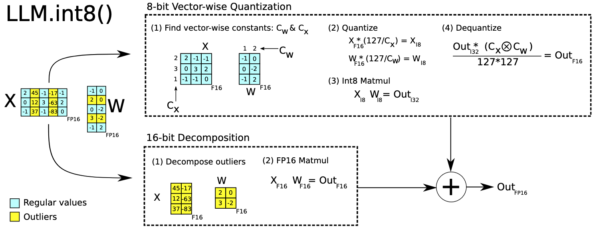

<p class="text-xs text-gray-400 mt-2 text-center"><em>
Dettmers, T., Lewis, M., Belkada, Y., & Zettlemoyer, L. (2022). LLM.int8 (): 8-bit matrix multiplication for transformers at scale. Advances in neural information processing systems, 35, 30318-30332.
</em></p>

---
layout: default
---
# What haven't we covered?
*Quite a lot*

- **Quantization-Aware Training (QAT)** — fine-tune with simulated quantization noise
- **Advanced LLM quantization** — GPTQ, AWQ, SmoothQuant, ...
- **Knowledge Distillation** — train a small student to mimic a large teacher
- **Low-rank Decomposition** — approximate weight matrices as products of smaller ones
- **Hardware-aware optimisation** — ONNX, TensorRT, CoreML, ...

... and the list goes on

---
layout: center
class: text-center
---

# Thanks for listening :)

Feel free to reach out!

<a href="http://rasgaard.com"> rasgaard.com </a>

roraa@dtu.dk, rasmus.aagaard@laerdal.com

<a href="http://linkedin.com/in/rasgaard">linkedin.com/in/rasgaard</a>