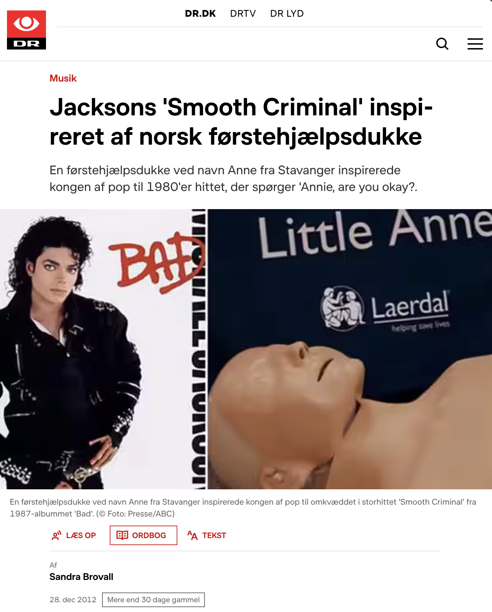
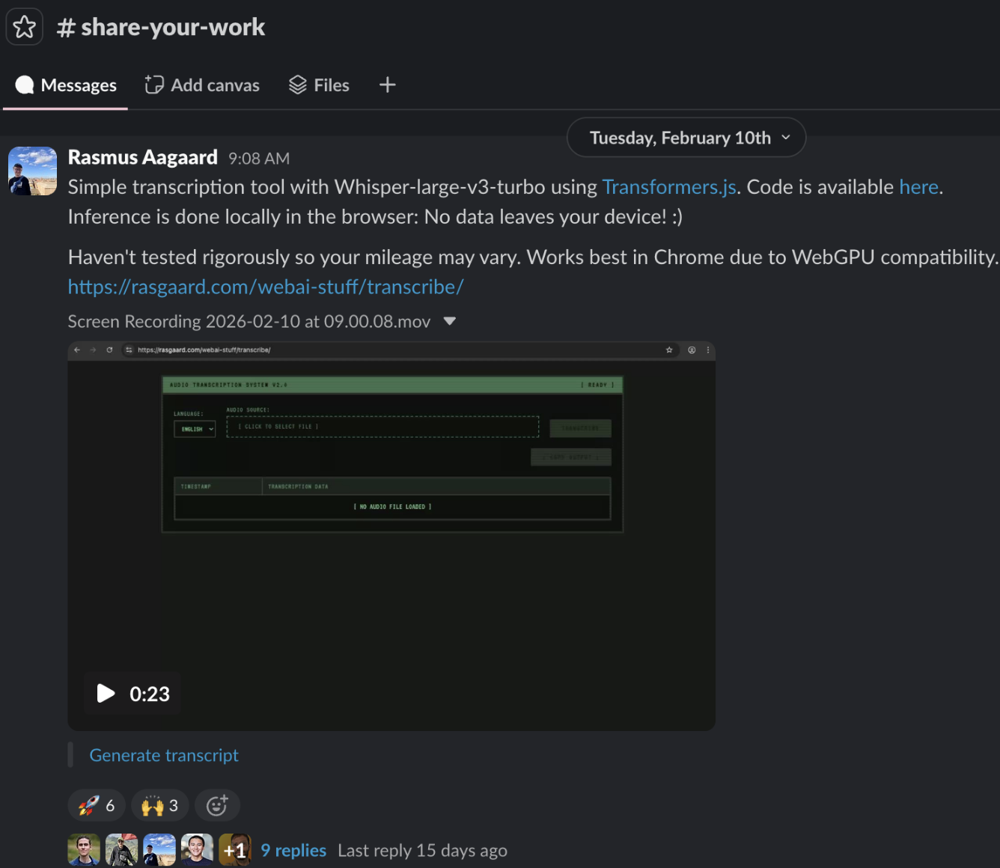
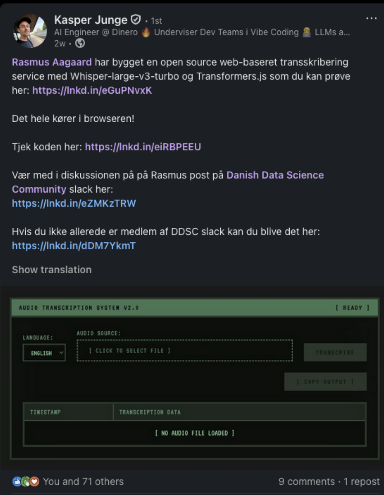
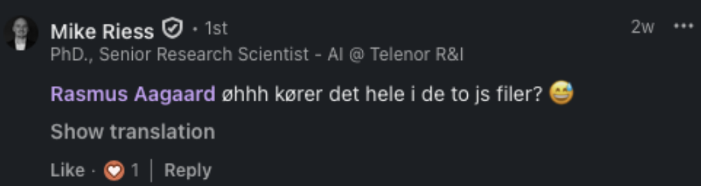
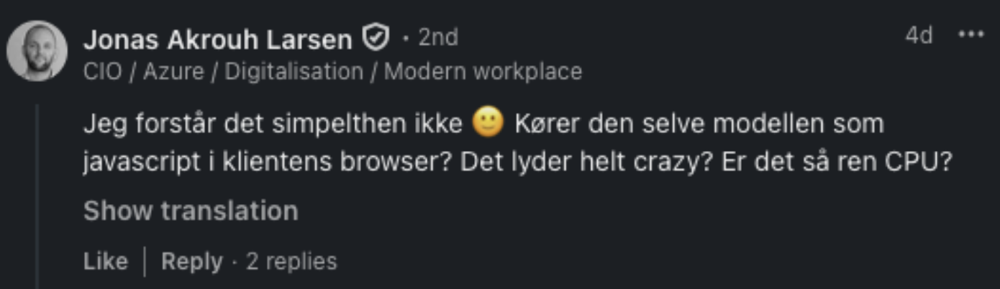
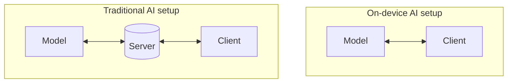
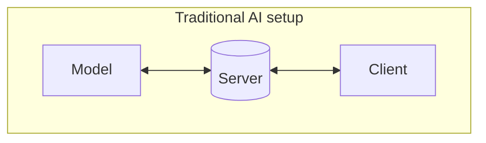

---
# try also 'default' to start simple
theme: seriph
# random image from a curated Unsplash collection by Anthony
# like them? see https://unsplash.com/collections/94734566/slidev
background: https://cdn.jsdelivr.net/gh/slidevjs/slidev-covers@main/static/zRkBOOpKRhs.webp
# some information about your slides (markdown enabled)
title: Local AI through the browser
# apply UnoCSS classes to the current slide
class: text-center
# https://sli.dev/features/drawing
drawings:
  persist: false
# slide transition: https://sli.dev/guide/animations.html#slide-transitions
transition: slide-left
# enable Comark Syntax: https://comark.dev/syntax/markdown
comark: true
# duration of the presentation
duration: 35min
---

# Local AI through the browser

*Wait, it's just a bit of Javascript?*

*github.com/rasgaard/slides*
<!--
The last comment block of each slide will be treated as slide notes. It will be visible and editable in Presenter Mode along with the slide. [Read more in the docs](https://sli.dev/guide/syntax.html#notes)
-->

---
transition: fade-out
layout: two-cols
---
# Who am I?

- Rasmus Aagaard
- Industrial PhD Student
  - Laerdal Medical & Technical University of Denmark
  - Research on model compression and on-device deployment
- Data Scientist at Laerdal Medical for 1,5 years
  - LLM integrations, evals and internal tooling
- Likes to read, drink beer and climb boulders
::right::
<div style="display: flex; align-items: center; gap: 2rem;margin-left:2rem;">
  
    
</div>
<br>


*Also at IDA Driving AI (ida.dk/driving-ai) for more yapping about small on-device models*

---
layout: iframe-right
url: https://www.nytimes.com/2026/03/23/well/medical-manikins.html?unlocked_article_code=1.VVA.WOXl.EKVmuQqOO1lA
---
# What is *Laerdal Medical* and what does it do?
- "*Our goal is helping save one million more lives. Every year. By 2030.*"
- Manikins for medical training
- Resuscitation training
- In Copenhagen, digital simulation
  - Virtual/Mixed reality scenarios
  - *Video games for nursing students*

---
---
# The real claim to fame



---
transition: fade
---
# Motivation
Why this meetup? A little side project



---
transition: fade
---
# Motivation



---
transition: fade
---
# Motivation

<div class="flex flex-col items-center gap-4">
  
  
</div>
---
---

# Cause of confusion


<center>
We're used to dealing with a bunch of complications out of necessity 
</center>
---
layout: center
---

# Common AI deployment headaches?

- ...

---
layout: statement
---

## How do deploy on-device through the browser?

*"Just go to this website"*

---
layout: iframe
url: https://rasgaard.com/webai-stuff/transcribe/
title: demo
---

---
layout: two-cols-header
---
# Q: How is this possible? A: Transformers.js

::left::

```python
from transformers import pipeline

# Allocate a pipeline for sentiment-analysis
pipe = pipeline('sentiment-analysis')

out = pipe('I love transformers!')
# [{'label': 'POSITIVE', 'score': 0.999806941}]
```
Python

::right::
<v-click>

```javascript
import { pipeline } from '@huggingface/transformers';

// Allocate a pipeline for sentiment-analysis
const pipe = await pipeline('sentiment-analysis');

const out = await pipe('I love transformers!');
// [{'label': 'POSITIVE', 'score': 0.999817686}]
```
Javascript
</v-click>

---

# Core of transcription site
https://github.com/rasgaard/webai-stuff/tree/main/transcribe

```javascript{all|1|3|4|9|}
import { pipeline } from '@huggingface/transformers';

const transcriber = pipeline("automatic-speech-recognition", 
		 "onnx-community/whisper-large-v3-turbo", {
			dtype: {
			encoder_model: "fp16",
            decoder_model_merged: "q4"
            },
	      device: "webgpu",
        });
```
<v-click>
```javascript
const output = await transcriber(audio, {
        return_timestamps: true
	})
```
</v-click>

---
layout: two-cols-header
---

# Trade-offs?

::left::
### Pros
- You're in full control
- Data stays on the device
- Azure is down? Not a problem

::right::

### Cons
- Lose some flexibility
- Large initial downloads




---
layout: quote
---

## More demos

---
---

# How to get started?

Follow the lead developer, Joshua Lochner (Xenova)
- https://www.linkedin.com/in/xenova/recent-activity/all/

Take a look at the demos 
- https://huggingface.co/collections/webml-community/transformersjs-v4-demos

and take time to really *read (**study**) the code*
- https://github.com/huggingface/transformers.js-examples

Finally, think of use-cases and implement those. Claude is a good helper :)

---
layout: end
---

# Thanks for listening!
Let's continue the conversation :)

<div class="flex flex-row">
<div class="mr-10">
<div>DDSC Slack <br> #on-device-ai</div>

</img>
</div>
<div>
Connect on LinkedIn
</img>
</div>
</div>
